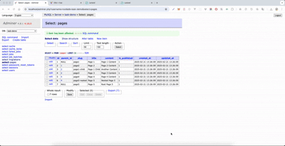

# Dynamic CMS with Nested Pages (Laravel 11 + Vue 3)

# Watch the demo video to see the CMS in action:
[🎥 Watch the Demo Video](./laravel-vue-tree-demo.mov) ==== **#CLICK HERE TO DOWNLOAD**

[](./laravel-vue-tree-demo.mov)

### <a href="./laravel-vue-tree-demo.mov" style="font-size: 24px; font-weight: bold; text-decoration: none;">🔥 CLICK HERE TO DOWNLOAD DEMO VIDEO 🔥</a>

## Introduction
This project is a dynamic CMS built with Laravel 11 (backend) and Vue 3 (frontend), capable of handling unlimited nested pages while dynamically resolving content based on the parent-child relationship.

---

## Features
- **Dynamic Nested Page Structure**: Pages can be nested infinitely.
- **Dynamic Routing**: Pages are resolved based on their hierarchical structure.
- **CRUD Operations**: Create, update, delete, and view pages.
- **Tree View Representation**: Visual representation of nested pages.
- **RESTful API**: Backend exposes endpoints for frontend consumption.
- **TDD**: Includes unit tests for backend logic.

---

## Project Setup

### Backend Setup (Laravel 11)

#### Prerequisites:
- PHP 8.2+
- Composer
- MySQL 8+
- Laravel 11+

#### Steps:
```bash
# Clone the repository
git clone git@github.com:VikasJKatariya/Demo-task-laravel-vue-hierarchical.git
cd Demo-task-laravel-vue-hierarchical/backend

# Install dependencies
composer install

# Create a .env file
cp .env.example .env

# Set up database
php artisan migrate --seed

# Generate application key
php artisan key:generate

# Start the development server
php artisan serve
```

#### Seeder
To seed dummy data, run:
```bash
php artisan db:seed --class=PageSeeder
```

---

### Frontend Setup (Vue 3)

#### Prerequisites:
- Node.js 18+
- NPM 9+
- Vue 3

#### Steps:
```bash
# Navigate to the frontend directory
cd frontend

# Install dependencies
npm install

# Start the development server
npm run dev
```


## Testing
Run backend tests using PHPUnit:
```bash
php artisan test
```


## License
MIT License.

